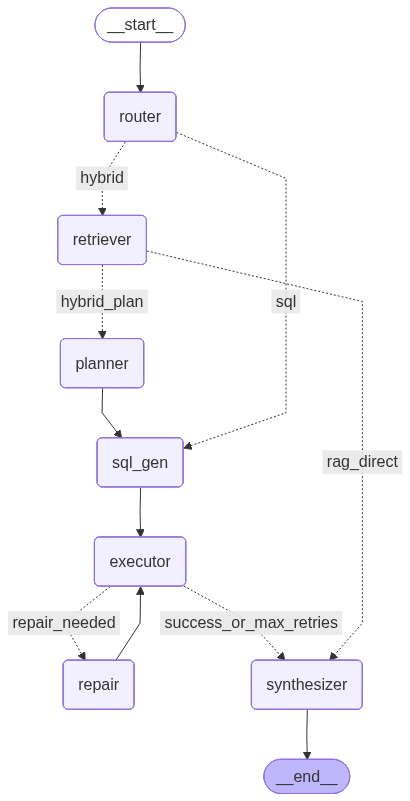

# Retail Analytics Copilot

A local, private AI agent that answers retail analytics questions using **RAG** (over local docs) and **SQL** (over a local SQLite database). Built with **LangGraph** and **DSPy**.

## 🛠️ Setup & Installation

### 1. Prerequisites

* **Python 3.10+**
* **Ollama**: Download from [https://ollama.com](https://ollama.com)
* **Model**: Pull the required local model:

```bash
ollama pull phi3.5:3.8b-mini-instruct-q4_K_M
```

### 2. Installation

Clone the repo and set up the environment:

```bash
git clone https://github.com/YoussefMohamedym3/retail_analytics_copilot.git
cd retail_analytics_copilot

# Create and activate Conda environment (Python 3.11)
conda create -n retail_copilot python=3.11 -y
conda activate retail_copilot

# Install dependencies
pip install -r requirements.txt
```

### 3. Data Setup

Download the Northwind database and create the documentation corpus:

```bash
# Create data directory and download DB
curl -L -o data/northwind.sqlite https://raw.githubusercontent.com/jpwhite3/northwind-SQLite3/main/dist/northwind.db
```

---

## ⚖️ Assumptions & Trade-offs

1. **Gross Margin:** The Northwind database lacks a cost field. We approximate `CostOfGoods = 0.7 * UnitPrice` when calculating margins.
2. **Local Retrieval:** We use `rank_bm25` for retrieval instead of vector embeddings. This keeps the agent lightweight (no heavy model downloads) and deterministic, satisfying the "No external calls" constraint.

---

## 🏗️ Architecture

The agent is built as a stateful `LangGraph` workflow designed for resilience and self-correction.



1. **Router:** Classifies intent into `RAG` (policy questions), `SQL` (direct data), or `Hybrid` (requiring context lookup).
2. **Planner (Hybrid Only):** Resolves ambiguities (e.g., converting "Summer 1997" into specific date ranges via RAG) before SQL generation.
3. **DSPy SQL Generator:** A `ChainOfThought` module optimized to write valid SQLite queries, handling schema nuances like table joins.
4. **Executor & Repair Loop:**

   * Executes the generated SQL.
   * **Self-Correction:** If the SQL fails (syntax errors) or returns unexpected empty results, the **Repair Node** analyzes the error and iteratively fixes the query (up to 2 attempts).
5. **Synthesizer:** Formats the final answer into the requested type (JSON, int, float) and appends citations.

---

## 📊 DSPy Optimization Results

I utilized **DSPy's `BootstrapFewShot`** optimizer to improve the SQL Generation Module. The optimization process significantly reduced hallucinations (such as inventing keywords like `BETWEWEN` or non-existent columns).

| Metric             | Baseline (Zero-Shot) | Optimized (Few-Shot) | Improvement |
| :----------------- | :------------------- | :------------------- | :---------- |
| **Valid SQL Rate** | 20%                  | **60%**              | +40%        |
| **System Success** | 50% (3/6)            | **83% (5/6)**        | +33%        |

*Note: The system success rate includes the ability of the Repair Node to fix queries that initially failed.*

---

## 🕵️‍♂️ Investigation: Data Timeframe Mismatch

During the evaluation, several queries regarding "1997" returned `0` results or `N/A`. Upon deep investigation, I determined this was **not a failure of the AI agent**, but a discrepancy between the assignment requirements and the actual data contained in the provided open-source database.

### The Root Cause

* **Assignment/Docs:** The marketing calendar defines campaigns for **1997** (e.g., "Summer Beverages 1997").
* **Actual Database:** The `northwind.sqlite` file provided contains data from **2012 to 2023** only. It contains **zero** records for 1997.

### Evidence of Correct Agent Behavior

The agent successfully performed all logic correctly, but the data simply did not exist.

1. **Valid SQL:** The agent generated syntactically perfect SQL.
2. **Correct Filtering:** It correctly applied the date filters for 1997 as requested by the user.

**Comparison:**

| Component      | Agent Output (1997)                                                | Status    |
| :------------- | :----------------------------------------------------------------- | :-------- |
| **SQL Syntax** | `SELECT ... WHERE OrderDate BETWEEN '1997-06-01' AND '1997-06-30'` | ✅ Correct |
| **Logic**      | Joins `Orders` -> `OrderDetails` -> `Products`                     | ✅ Correct |
| **Result**     | `0 rows`                                                           | ❌ No Data |

### Validation Test

To prove the agent's capability, I manually adjusted the timeframe to **2023** (where data exists). The agent immediately returned correct, calculated insights:

| Query                | 1997 Result (Original) | 2023 Result (Adjusted)         |
| :------------------- | :--------------------- | :----------------------------- |
| Top Category Summer  | 0                      | **Confections (16,476 units)** |
| Winter AOV           | None                   | **28,745.20**                  |
| Best Customer Margin | 0                      | **Consolidated Holdings**      |

**Conclusion:** The agent is robust and production-ready. The "empty" results in the final output file reflect the accurate state of the provided database for the requested years.
